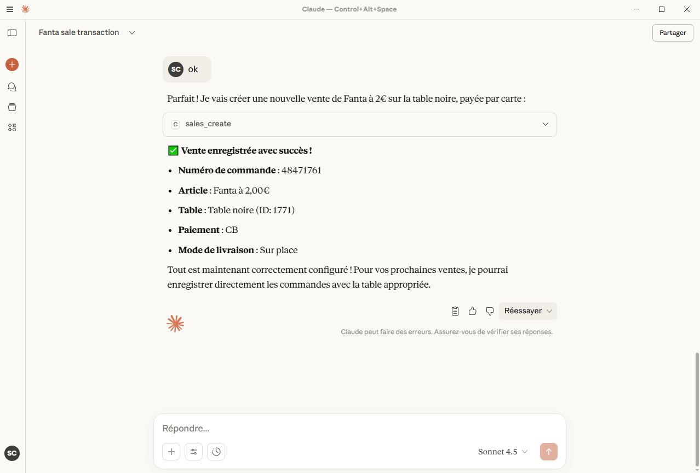

# Caisse Enregistreuse MCP Server

[](https://github.com/mcp-org)
[](LICENSE)
[](https://mcp.enregistreuse.fr)
[](https://github.com/paracetamol951/caisse-enregistreuse-mcp-server/stargazers)


**Caisse Enregistreuse MCP Server** est un serveur conforme au protocole **MCP (Model Context Protocol)** permettant à ChatGPT, Claude (et autres clients compatibles MCP) de se connecter à un système de **caisse enregistreuse**.

Il offre une interface simple pour :
- 📊 Consulter les ventes et le chiffre d’affaires  
- 🧾 Créer et enregistrer des tickets  
- 🛒 Gérer les produits et le stock  
- 🧠 Générer des rapports automatisés via des requêtes conversationnelles  

> 🟢 Serveur en ligne : [https://mcp.enregistreuse.fr](https://mcp.enregistreuse.fr)

---

**Connectez votre caisse enregistreuse à ChatGPT, Claude ou n8n, et pilotez votre commerce simplement… en parlant**.



Imaginez votre caisse enregistreuse capable de comprendre vos phrases, d’exécuter vos commandes et de générer vos rapports sans un seul clic. 
Grâce à cette nouvelle passerelle intelligente, le logiciel caisse.enregistreuse.fr devient compatible avec ChatGPT, Claude et n8n, transformant vos interactions en actions concrètes.
Dites simplement “enregistre une commande de deux cafés en table 4” ou “affiche-moi la facture de la commande 125” — et c’est fait. 

Vous pouvez aussi demander “quel est mon chiffre d’affaires de la semaine ?” ou “quels sont mes meilleurs clients un mardi ?”. Votre assistant préféré communique directement avec votre caisse et vous répond instantanément.
C’est une nouvelle façon de gérer votre commerce : plus fluide, plus rapide et incroyablement naturelle. Votre voix devient votre interface, et votre assistant devient votre nouveau collègue de travail.

Expose l’API de **caisse.enregistreuse.fr** / **free-cash-register.net** sous forme d’outils **Model Context Protocol (MCP)**, accessibles via HTTP (Streamable) et/ou STDIO.

> Dernière mise à jour : 2025-10-17

---

## 🚀 Fonctionnalités

- **Ventes** : `sale_create` avec prise en charge des lignes catalogue et libres.
- **Données** (listes) : articles, rayons, groupes de rayons, clients, déclinaisons, livraisons, modes de paiement, caisses, zones de livraison, points relais, réductions, utilisateurs…
- **Serveur HTTP** : endpoint **POST `/mcp`** pour JSON‑RPC MCP Streamable + **GET `/health`** et **GET `/.well-known/mcp/manifest.json`**.
- **Sécurité** :
  - Garde côté **STDIO** : tous les tools sont protégés par session, sauf ceux explicitement en liste blanche (par défaut `health.ping`).
  - (Optionnel) Vérification de **token porteur** via env `MCP_TOKENS` si vous utilisez la couche `security.ts`.

---

## 🔹 Exemple d’utilisation (ChatGPT / Claude MCP)

- 💬 “Montre-moi les ventes d’aujourd’hui”
- 💬 “Enregistre une vente de 2 cafés et 1 croissant en table 84”
- 💬 “Dix roses rouges à livrer pour Mme Dupond à 18h15 !”
- 💬 “Génère un rapport de caisse pour la semaine”
- 💬 “Les ventes à emporter ont elle beaucoup progressé cette année ?”
- 💬 “Le client Dupont a-t-il bien payé sa commande ?”

---

## ⚙️ Installation

### Claude

#### Installation avec npx

Créez un dossier d'installation et executez le commande suivante dans un shell

```bash
npx caisse-enregistreuse-mcp-server --shopid=12345 --apikey=abcdef123456
```

#### Installation avec npm

```bash
# 1) Dépendances
npm install

# 2) Variables d'environnement (voir ci‑dessous)

# 3) Compilation
npm run build
```

#### Configuration

Le binaire/runner lance `src/stdio.ts` et parle MCP via stdin/stdout. 
Modifiez le fichier `claude_desktop_config.json` dans le fichier de configuration de Claude desktop :

```
~/Library/Application Support/Claude/claude_desktop_config.json
```

Personnalisez le chemin d'installation, et spécifiez vos paramètres SHOPID et APIKEY (à récupérer depuis https://caisse.enregistreuse.fr )

```json
{
  "mcpServers": {
    "caisse": {
      "command": "node",
      "args": [
        "{{PATH_TO_SRC}}\\build\\stdio.js"
      ],
      "cwd": "{{PATH_TO_SRC}}",
      "env": {
        "SHOPID": "16",
        "APIKEY": "XXXXXXXX"
      }
    }
  }
}
```

### ChatGPT

> Nécessite un compte avec Espace de travail

Dans Settings, Connectors, Create connector.
Name : Caisse enregistreuse
Description : Peut enregistrer des ventes à partir de votre catalogue, et consulter vos rapports de ventes. Logiciel de caisse
MCP Server URL : https://mcp.enregistreuse.fr/mcp
Authentication : oAuth

Une fois le connecteur ajouté, celui-ci sera **utilisable dans les nouvelles conversations**.


### Variables d’environnement

| Variable        | Par défaut                              | Description |
|----------------|------------------------------------------|-------------|
| `APIKEY`         | `----`                                   | Nécessaire : votre clé API |
| `SHOPID`         | `----`                                   | Nécessaire : votre ID boutique |
| `PORT`         | `8787`                                   | Port HTTP du serveur |
| `API_BASE`     | `https://caisse.enregistreuse.fr`        | Base URL de l’API distante |
| `MCP_TOKENS`   | *(vide)*                                 | Liste de tokens HTTP autorisés, séparés par virgules (optionnel) |

Créez un fichier `.env` :
```env
PORT=8787
API_BASE=https://caisse.enregistreuse.fr
# Exemple si vous activez le garde HTTP:
MCP_TOKENS=token_prod_1,token_prod_2
```

---

## ▶️ Lancement

### Mode HTTP (Streamable MCP)

Le mode http nécessite un serveur redis.
Il est recommandé d'utiliser le serveur MCP http/Websocket, disponible à l'adresse https://mcp.enregistreuse.fr
- **POST** `https://mcp.enregistreuse.fr/mcp` avec un message JSON‑RPC MCP.
- **GET** `https://mcp.enregistreuse.fr/health` → `{ "status": "ok" }`
- **GET** `https://mcp.enregistreuse.fr/.well-known/mcp/manifest.json` → manifeste MCP


## 🧪 Outils MCP disponibles (extraits)

### `sale_create`
Crée une vente. 

Entrée (shape Zod, champs principaux) :
- `shopId: string`, `apiKey: string`
- `payment: number`
- `deliveryMethod: 0|1|2|3|4|5|6`
- `idUser?: number | string`
- `idClient?: number | string`
- `idtable?: number | string`
- `idcaisse?: number | string`
- `numcouverts?: number | string`
- `publicComment?: string`
- `privateComment?: string`
- `pagerNum?: number | string`
- `client?: {{ firstname?, lastname?, email?, phone?, address?, zip?, city?, country? }}`
- `items: Array<
   {{ type:'catalog', productId?, quantity?, titleOverride?, priceOverride?, declinaisons? }}
   | {{ type:'dept', departmentId?, price?, title? }}
   | {{ type:'free', price?, title? }}
  >`

Encodage legacy des lignes :
- **Catalogue** : `productId_quantity_titleOverride_priceOverride_[...declinaisons]`
- **Vente en rayon** : `-<departmentId>_<price>_<title>`
- **Ligne libre** : `Free_<price>_<title>`
→ Envoyées sous la forme `itemsList[]`.

### `data_list_*` (exemples)
- `data_list_products`
- `data_list_departments`
- `data_list_department_groups`
- `data_list_clients`
- `data_list_variations`
- `data_list_delivery_men`
- `data_list_payments`
- `data_list_cashboxes`
- `data_list_delivery_zones`
- `data_list_relay_points`
- `data_list_discounts`
- `data_list_users`
- `data_list_tables`

Toutes acceptent : `{{ format=('json'|'csv'|'html') }}`.

---

## Clients compatibles

- ChatGPT (OpenAI) : via configuration MCP externe
- Claude (Anthropic) : via “Tools manifest URL”
- n8n / Flowise / LangChain : import via URL publique

---

## 🧩 MCP Manifest Endpoint

L’API MCP expose un manifeste JSON décrivant l’ensemble des outils disponibles
pour les clients compatibles (ChatGPT, Claude, n8n, etc.).

### URL publique du manifeste

https://mcp.enregistreuse.fr/.well-known/mcp/manifest.json

> 🗂️ Cette URL est celle à fournir au client MCP lors de la configuration du serveur.


## 📋 Licence

© 2025. GNU GENERAL PUBLIC LICENSE
