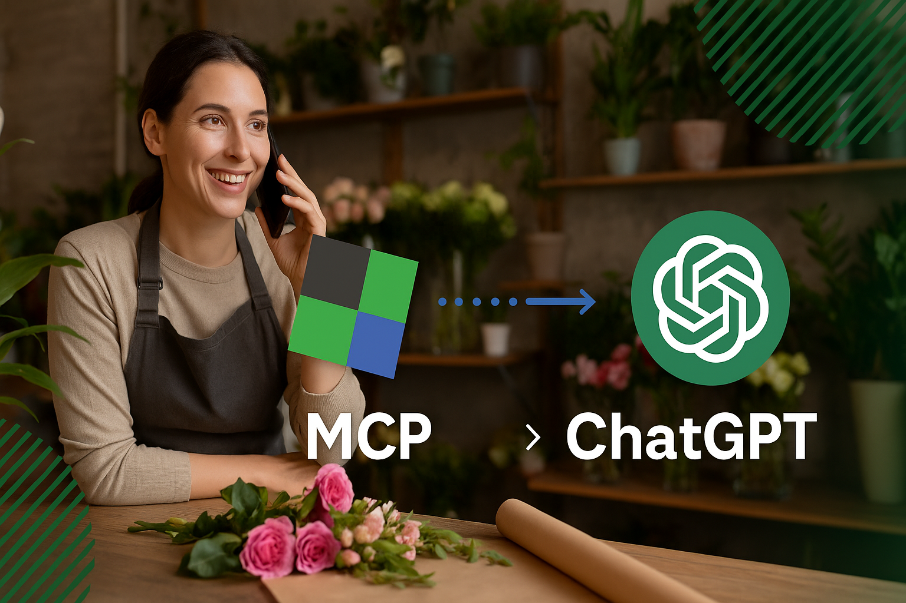
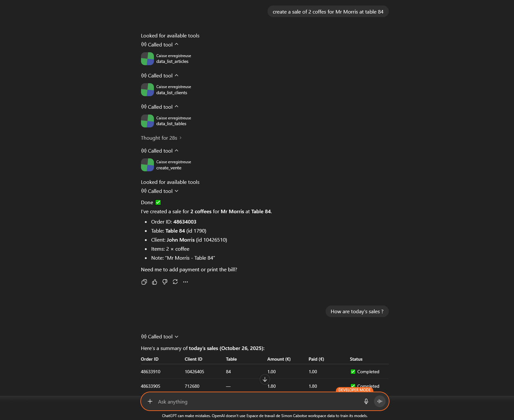

# 🧾 Kash MCP Server

[](LICENSE)
[](https://mcp.kash.click)
[](https://github.com/paracetamol951/caisse-enregistreuse-mcp-server/stargazers)

[](https://www.youtube.com/watch?v=PpkrUfEy4ns)

**Kash MCP Server** is a server compliant with the **MCP (Model Context Protocol)**, allowing ChatGPT, Claude, and other MCP-compatible clients to connect to a **sales recorder system** (or POS, cash register).

It provides a simple interface to:
- 📊 View sales and revenue  
- 🧾 Create and record receipts  
- 🛒 Manage products and stock  
- 🧠 Generate automated reports through conversational requests  

> 🟢 Live Server: [https://mcp.kash.click](https://mcp.kash.click)

---

**Connect your cash register to ChatGPT, Claude, or n8n — and manage your business simply by talking.**



Imagine your cash register understanding your sentences, executing your commands, and analyzing your reports — without a single click.  
With this intelligent gateway, the **free-cash-register.net** software becomes compatible with ChatGPT, Claude, and n8n, transforming your interactions into concrete actions.  
Just say “record an order for two coffees at table 4” or “show me the invoice for order 125” — and it’s done.  

You can also ask “what’s my revenue for this week?” or “who are my best customers on Tuesdays?”.  
Your favorite assistant communicates directly with your cash register and responds instantly.  
This is a new way to run your business: smoother, faster, and incredibly natural.  
Your **voice becomes your interface**, and your **assistant becomes your new coworker**.

This project exposes the **kash.click** API as **Model Context Protocol (MCP)** tools, available over **HTTP (Streamable)** and/or **STDIO**.

---

## 🚀 Features

- **Sales**: `sale_create` with support for catalog and free lines.
- **Orders** : get the order list in the specified date range
- **Data** (lists): products, departments, department groups, clients, variations, deliveries, payment methods, cashboxes, delivery zones, relay points, discounts, users…

---

## 🔹 Example usage (ChatGPT / Claude MCP)

- 💬 “Show me today’s sales”  
- 💬 “Record a sale of 2 coffees and 1 croissant at table 84”  
- 💬 “Ten red roses to deliver to Mrs. Dupond at 6:15 PM!”  
- 💬 “Generate a cash register report for the week”  
- 💬 “Have takeaway sales increased this year?”  
- 💬 “Did customer Dupont pay for their order?”

---

## ⚙Prerequisities

You need to have a free-cash-register.net account.

If you don't have one, you can register at :

https://kash.click/free-pos-software/ChatGPT

Then in the software, you have to get your APIKEY and SHOPID in Setup, Webservices page.

---

## ⚙️ Installation

### Claude

#### Minimum installation

Edit the file `claude_desktop_config.json` in your Claude Desktop configuration directory:

Windows
```
%APPDATA%\Claude\claude_desktop_config.json
```

Mac OS
```
~/Library/Application Support/Claude/claude_desktop_config.json
```

Provide the following content after replacing your SHOPID and APIKEY.

```json
  {
  "mcpServers": {
    "caisse": {
      "command": "npx",
      "args": [
        "caisse-enregistreuse-mcp-server",
        "--shopid=[replaceWithYourSHOPID]",
        "--apikey=[replaceWithYourAPIKEY]"
      ]
    }
  }
}
```

#### Install via npx

Create an installation folder and run the following command in your shell:

```bash
npx caisse-enregistreuse-mcp-server --shopid=12345 --apikey=abcdef123456
```

#### Install via npm

```bash
# 1) Dependencies
npm install

# 2) Environment variables (see below)

# 3) Build
npm run build
```

#### Configuration

The binary/runner launches `src/stdio.ts` and communicates via MCP stdin/stdout.  
Edit the file `claude_desktop_config.json` in your Claude Desktop configuration directory
Customize the installation path and set your SHOPID and APIKEY (retrieve them from [https://kash.click](https://kash.click)):

```json
{
  "mcpServers": {
    "caisse": {
      "command": "node",
      "args": [
        "{{PATH_TO_SRC}}/build/stdio.js"
      ],
      "cwd": "{{PATH_TO_SRC}}",
      "env": {
        "SHOPID": "16",
        "APIKEY": "XXXXXXXX"
      }
    }
  }
}
```

### ChatGPT

> Requires a workspace account

In **Settings → Connectors → Create Connector**, fill in the following:

| Variable | Value |
|-----------|--------|
| `Name` | `Kash POS` |
| `Description` | `Can record sales from your catalog and retrieve your sales reports. POS software integration.` |
| `MCP Server URL` | `https://mcp.kash.click/mcp` |
| `Authentication` | `oAuth` |

Once added, the connector will be **available in new conversations**.

---

### Environment variables

| Variable | Default | Description |
|-----------|----------|-------------|
| `APIKEY` | `----` | Required: your API key |
| `SHOPID` | `----` | Required: your shop ID |

Create a `.env` file:

```env
APIKEY=XXXXXXXXXXXXXX
SHOPID=XXX
```

---

## ▶️ Launch

### HTTP Mode (Streamable MCP)

The HTTP mode requires a Redis server.  
It is recommended to use the hosted MCP HTTP/WebSocket server available at [https://mcp.kash.click](https://mcp.kash.click):

- **POST** `https://mcp.kash.click/mcp` with a JSON-RPC MCP message  
- **GET** `https://mcp.kash.click/health` → `{ "status": "ok" }`  
- **GET** `https://mcp.kash.click/.well-known/mcp/manifest.json` → MCP manifest  

---

## 🧪 Available MCP Tools (excerpt)

### `sale_create`
Creates a sale.

Input (Zod schema, main fields):
- `shopId: string`, `apiKey: string`
- `payment: number`
- `deliveryMethod: 0|1|2|3|4|5|6`
- `idUser?: number | string`
- `idClient?: number | string`
- `idtable?: number | string`
- `idcaisse?: number | string`
- `numcouverts?: number | string`
- `publicComment?: string`
- `privateComment?: string`
- `pagerNum?: number | string`
- `client?: {{ firstname?, lastname?, email?, phone?, address?, zip?, city?, country? }}`
- `items: Array<
   {{ type:'catalog', productId?, quantity?, titleOverride?, priceOverride?, declinaisons? }}
   | {{ type:'dept', departmentId?, price?, title? }}
   | {{ type:'free', price?, title? }}
  >`

Legacy item encoding:
- **Catalog**: `productId_quantity_titleOverride_priceOverride_[...declinaisons]`
- **Department sale**: `-<departmentId>_<price>_<title>`
- **Free line**: `Free_<price>_<title>`
→ Sent as `itemsList[]`.

### `data_list_*` (examples)
- `data_list_products`
- `data_list_departments`
- `data_list_department_groups`
- `data_list_clients`
- `data_list_variations`
- `data_list_delivery_men`
- `data_list_payments`
- `data_list_cashboxes`
- `data_list_delivery_zones`
- `data_list_relay_points`
- `data_list_discounts`
- `data_list_users`
- `data_list_tables`

All accept: `{{ format=('json'|'csv'|'html') }}`.

---

## 💻 Compatible Clients

- **ChatGPT (OpenAI)** — via external MCP configuration  
- **Claude (Anthropic)** — via “Tools manifest URL”  
- **n8n / Flowise / LangChain** — import via public URL  

---

## 🧩 MCP Manifest Endpoint

The MCP API exposes a JSON manifest describing all available tools for compatible clients (ChatGPT, Claude, n8n, etc.).

### Public manifest URL

https://mcp.kash.click/.well-known/mcp/manifest.json

> 🗂️ This URL is the one to provide to your MCP client when configuring the server.

---

## 📋 License

© 2025. GNU GENERAL PUBLIC LICENSE

## Hosted deployment

A hosted deployment is available on [Fronteir AI](https://fronteir.ai/mcp/paracetamol951-caisse-enregistreuse-mcp-server).

